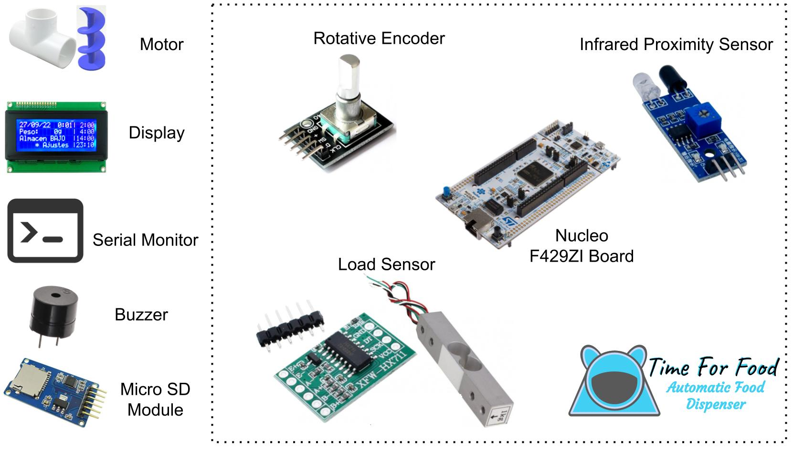

    

# Time For Food - Automatic food dispenser for pets
Time For Food is a food dispenser for pets regulated by time, desired food weigth, event log in SD card, settings retsoration in case of power fault, alarm, and a user interface from a display and a rotary encoder for complete configuration. The STM32 NUCLEO-F429ZI board is programmed in C++ language.

    

[Repository](https://github.com/AEWehle/TP_Wehle_SistEmb)

[Memory and documentation](https://docs.google.com/document/d/1N_jcAnnVCSna07N2jzv9-zDmV-DazLcwWZghMPTM5UA/edit?usp=sharing)

[Short video 00:02:23](https://github.com/AEWehle/TP_Wehle_SistEmb/blob/master/video%20-%20time%20for%20food.mp4). 
[Secondary link for video](https://drive.google.com/file/d/1A6ycF8dj406sMSafjcJQT6d2JPbaW2a8/view?usp=sharing)

    
    

## Description and block diagram
The automatic food dispenser with weigth control developed has the following characteristics:

A NUCLEO-F429ZI board, administration and control of all the features.

* A storage ocntainer for food with low food sensor.

* Motor that pushes the food.

* Releasing food by time. Available up to 144 per day, that is, a time every 10 minutes.

* Bowl food weigth control. Select for Release up to a desired food load or Always release a desired food load.

* A knob for manual food release.

* A micro SD card for event log and save settings. 

* The events are food decrease, food increase and empty storage. The events have the time, food load in bowl and storage state.

* The times for food are saved on the SD card to be restored in case of power fault.

* Empty storage alarm with sound option. Triggers when its time for food but no food is released.

* A user interface with siplay and encoder. Show the following four time for food, date and time, actual food load and storage state.

* The user interface allows set the Time for food, desired loas, date and time, and allows manual releasing food, bowl tare and enable/disable sound alarm.

* powered by cellphone charger.

In the next block diagram all the components ar shown.

    

thid dispenser differ from existing ones for:

* Event log. The user has control over when and how much their pet eats.

* Food availability for the pet in case of power fault.

* Empty storage alarm.

## Repository organisation

The repository has de next structure

    .
    ├── images
    ├── modules
    │   ├── motor
    │   ├── pc_serial_com
    │   ├── time_for_food
    │   ├── sd_card
    │   └── ...
    ├── main.cpp
    ├── README.md
    └── ...

Where the files and folders are:
* `images/`: folder for images.
* `modules/`: folder with the system scripts.
* `main.cpp`: System main fail.
* `README.md`.
* Other files like licence and settings of Mbed, etc.

## User manual

In the reppport display are shown
En la pantalla principal are shown the following four time for food, date and time, actual food load and storage state (OK, BAJO o VACIO).

Pressing it goes to setting:

1* Back to repport.
2* Change date and time
3* Release food.
4* Food time and load programing. 
5* Bowl tare.
6* Enable/disable sound alar.

### Change date and time

With the encoder select the actual date and time.

### Release food

Whit the encoder scroll the motor pushes food to the bowl, presseing returns to settings.

### Food time and load programing

1* Back to settings
3* Release food up to. Release food util the desired food. Scroll For change the desired food load. Closed loop.
4* Always release. Release the same food load. Scroll For change the desired food load. Open loop.
5* Add a Time for food.
6* Time for food list. You can delete or modify them.

### Bowl tare

If the bowl pet is changed then you must set a new bowl tare with this new one empty.

### Enable/disable sound alarm

Presseing swtitch his state. If ON and the storage is EMPTY, a sound notify every 30 minutes and the repport display show EMPTY storage state. If OFF the repport display show EMPTY storage state.

The EMPTY state trigger when it try release food but the food load in bowl does not change.

## Settings from PC

Using PC serial communication at 11520 baudrate you have accessibility for all this settings and also view the event log.

    

# Time For Food - Dispenser de alimentos para mascotas
Trabajo práctico final de sistemas embebidos. 
Time For Food es un dispenser de alimento para mascotas por horarios, con control de peso configurable, registro de eventos en tarjeta SD, restauración de horarios en caso de corte de luz, alarma, y una interfaz de usuario a partir de un display y un encoder rotativo para su completa configuración. Se programa en lenguaje C++ la placa NUCLEO-F429ZI de STM32.

    

[Repositorio](https://github.com/AEWehle/TP_Wehle_SistEmb)

[Memoria y documentación](https://docs.google.com/document/d/1N_jcAnnVCSna07N2jzv9-zDmV-DazLcwWZghMPTM5UA/edit?usp=sharing)

[Video breve 00:02:23](https://github.com/AEWehle/TP_Wehle_SistEmb/blob/master/video%20-%20time%20for%20food.mp4). 
[link secundario al video](https://drive.google.com/file/d/1A6ycF8dj406sMSafjcJQT6d2JPbaW2a8/view?usp=sharing)

    
    

## Descripción y Diagrama de bloques
El dispenser de alimentos automático y control de peso desarrollado en este trabajo cuenta con:

Una placa con microcontrolador NUCLEO-F429ZI de STM32, que se encarga de la administración y control de todas las características.

* Un recipiente de almacenamiento con sensor de bajo almacenamiento.

* Un motor que empuja el alimento

* Control de horarios de liberación. Configurables hasta 144 en día, con una separación de 10 minutos.

* Control de peso de comida en el bowl. Configurable para liberar hasta un peso determinado en el bowl o para liberar siempre la misma cantidad.

* Una palanca para la liberación manual de comida.

* Una tarjeta SD donde se almacena un registro de los eventos y los horarios de comida. 

* Se registran los eventos de disminución y aumento de peso en bowl y cuando se detecta almacenamiento vacío. En cada evento se incluye la fecha, hora, peso actual y estado de almacenamiento.

* Se registran los horarios de comida que permitan la restauración de dichos en casos de falla eléctrica.

* Alarma de almacenamiento vacío deshabilitado, suena en caso de intentar liberar alimento y no registrar cambios.

* La interfaz de usuario cuenta con un display y encoder rotativo. Permite al usuario ver los próximos cuatro horarios del día, la fecha y hora, el peso actual y el estado del almacenamiento. 

* Con la interfaz de usuario se pueden configurar los horarios, pesos, fecha y hora,  liberar un poco de alimento, la tara de bowl y desactivar la alarma de almacenamiento vacío.

* Alimentación de 5V. Compatible con cargador de celular.

Se observa en la siguiente figura un diagrama en bloques donde se encuentran todos los componentes utilizados.

    

Este equipo destaca de ya existentes por:

* La utilización de registro de eventos, permitiendo al usuario tener un control de cuándo y cuánto come la mascota. 

* Seguridad de comida a la mascota. En caso de falla eléctrica se restauran los horarios configurados.

* Alarma en caso de almacenamiento vacío.

## Organización del repositorio

El repositorio se organiza con la siguiente estructura

    .
    ├── images
    ├── modules
    │   ├── motor
    │   ├── pc_serial_com
    │   ├── time_for_food
    │   ├── sd_card
    │   └── ...
    ├── main.cpp
    ├── README.md
    └── ...

En donde se tienen las carpetas o archivos:
* `images/`: carpeta que incluye imágenes.
* `modules/`: carpeta que contiene los archivos fuente de los distintos módulos que integran el programa del sistema.
* `main.cpp`: archivo principal del programa del sistema.
* `README.md`: este archivo *read me*.
* Otros archivos tales como licencia, archivos de configuración de mBed OS, etc.

## Manual de uso

En la pantalla principal o de reporte permite al usuario ver los próximos cuatro horarios del día, la fecha y hora, el peso actual y el estado del almacenamiento (OK, BAJO o VACIO). 

Al presionar se pasa a la sección de ajustes con las opciones:

1* Volver al estado de reporte.
2* Cambiar fecha y hora actual.
3* Orden de liberar alimento.
4* Programar horarios. 
5* Establecer Tara de bowl.
6* Activar/Desactivar alarma de poco almacenamiento.

### Cambiar Fecha y Hora

Se puede volver al menu de ajustes o presionando se puede elegir qué valor modificar. Al girar se modifica el valor o se cambia de renglón.

### Liberar alimento

Girando la perilla se acciona el motor para liberar alimento, al presionar se vuelve a menu de ajustes.

### Programar horarios

1* Volver a ajustes
3* Liberar hasta. Activa modo lazo cerrado y girando y establece el peso límite.
4* Liberar siempre. Activa el modo lazo abierto  y cambia el peso a liberar.
5* Agregar un horario.
6* Lista de los horarios guardados y que se pueden modificar o borrar.

### Establecer tara del bowl

Cuando se quiere modificar el bowl a utilizar se debe establecer la nueva tara. El bowl nuevo debe estar vacío, presionar para establever la tara

### Activar/Desactivar alarma de almacenamiento VACIO.

Al presionar cambiará de estado. Si el almacenmaiento está VACIO sonará una alarma cada 30 minutos, a menos que se se establezca en OFF.

El estado de VACIO se llega cuando se intenta liberar alimento y no se modifica el peso en el bowl.

## Configuración desde la computadora

Se puede utilizar el dispositivo conectacntolo a la computadora con una terminal a 11520 de baudrate. Permite configurar lo mismo que desde la interfaz de usuario pero además permite ver los eventos almavcenados en la tarjeta SD.

