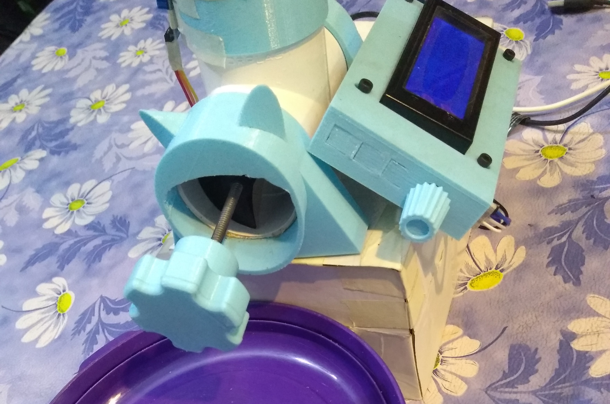
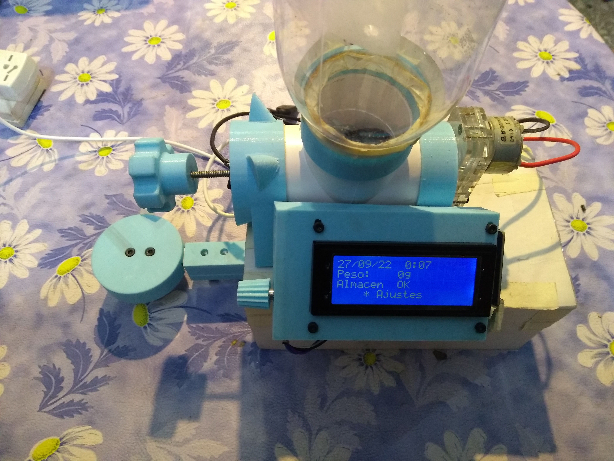
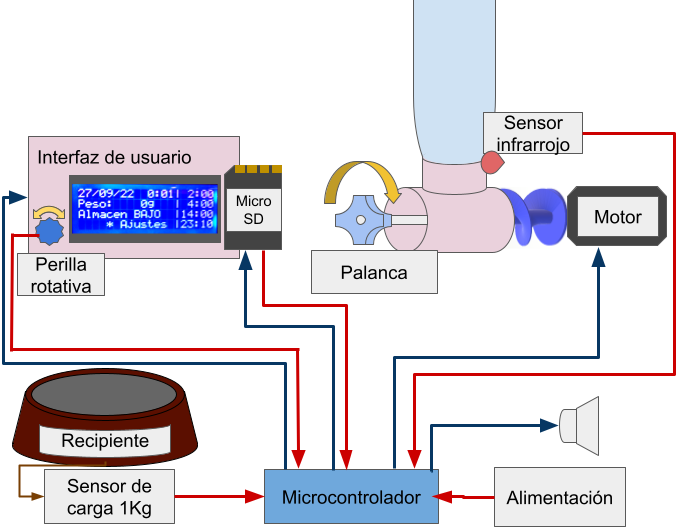

# Dispenser de alimentos para mascotas
Trabajo práctico final de sistemas embebidos. Dispenser de alimento para mascotas automático por horarios con control de peso,
utilizando como plataforma de desarrollo una placa STM32 NUCLEO*F429ZI.

[Repositorio](https://github.com/AEWehle/TP_Wehle_SistEmb)

Memoria y documentación: A agregar

    
    

## Descripción y Diagrama de bloques
El dispenser de alimentos automático y control de peso desarrollado en este trabajo cuenta con:

Una placa con microcontrolador NUCLEO*F429ZI de STM32, que se encarga de la administración y control de todas las características.

* Un recipiente de almacenamiento con sensor de bajo almacenamiento.

* Un motor que empuja el alimento

* Control de horarios de liberación. Configurables hasta 144 en día, con una separación de 10 minutos.

* Control de peso de comida en el bowl. Configurable para liberar hasta un peso determinado en el bowl o para liberar siempre la misma cantidad.

* Una palanca para la liberación manual de comida.

* Una tarjeta SD donde se almacena un registro de los eventos y los horarios de comida. 

* Se registran los eventos de disminución y aumento de peso en bowl y cuando se detecta almacenamiento vacío. En cada evento se incluye la fecha, hora, peso actual y estado de almacenamiento.

* Se registran los horarios de comida que permitan la restauración de dichos en casos de falla eléctrica.

* Alarma de almacenamiento vacío deshabilitado, suena en caso de intentar liberar alimento y no registrar cambios.

* La interfaz de usuario cuenta con un display y encoder rotativo. Permite al usuario ver los próximos cuatro horarios del día, la fecha y hora, el peso actual y el estado del almacenamiento. 

* Con la interfaz de usuario se pueden configurar los horarios, pesos, fecha y hora,  liberar un poco de alimento, la tara de bowl y desactivar la alarma de almacenamiento vacío.

* Alimentación de 5V. Compatible con cargador de celular.

Se observa en la siguiente figura un diagrama en bloques donde se encuentran todos los componentes utilizados.

    

Este equipo destaca de ya existentes por:

* La utilización de registro de eventos, permitiendo al usuario tener un control de cuándo y cuánto come la mascota. 

* Seguridad de comida a la mascota. En caso de falla eléctrica se restauran los horarios configurados.

* Alarma en caso de almacenamiento vacío.

## Organización del repositorio

El repositorio se organiza con la siguiente estructura

    .
    ├── images
    ├── modules
    │   ├── motor
    │   ├── pc_serial_com
    │   ├── time_for_food
    │   ├── sd_card
    │   └── ...
    ├── main.cpp
    ├── README.md
    └── ...

En donde se tienen las carpetas o archivos:
* `images/`: carpeta que incluye imágenes.
* `modules/`: carpeta que contiene los archivos fuente de los distintos módulos que integran el programa del sistema.
* `main.cpp`: archivo principal del programa del sistema.
* `README.md`: este archivo *read me*.
* Otros archivos tales como licencia, archivos de configuración de mBed OS, etc.

## Manual de uso

En la pantalla principal o de reporte permite al usuario ver los próximos cuatro horarios del día, la fecha y hora, el peso actual y el estado del almacenamiento (OK, BAJO o VACIO). 

Al presionar se pasa a la sección de ajustes con las opciones:

1* Volver al estado de reporte.
2* Cambiar fecha y hora actual.
3* Orden de liberar alimento.
4* Programar horarios. 
5* Establecer Tara de bowl.
6* Activar/Desactivar alarma de poco almacenamiento.

### Cambiar Fecha y Hora

Se puede volver al menu de ajustes o presionando se puede elegir qué valor modificar.

### Liberar alimento

Girando la perilla se acciona el motor para liberar alimento, al presionar se vuelve a menu de ajustes, al girar se modifica el valor o se cambia de renglón.

### Programar horarios

1* Volver a ajustes
3* Liberar hasta. Activa modo lazo cerrado y girando cambia el peso a liberar.
4* Liberar siempre. Activa el modo lazo cerrado y establece el peso límite.
5* Agregar un horario.
6* Lista de los horarios guardados y que se pueden modificar o borrar.

### Establecer tara del bowl

Cuando se quiere modificar el bowl a utilizar se debe establecer la nueva tara. El bowl nuevo debe estar vacío, presionar para establever la tara

### Activar/Desactivar alarma de almacenamiento VACIO.

Al presionar cambiará de estado. Si el almacenmaiento está VACIO sonará una alarma cada 30 minutos, a menos que se se establezca en OFF.

El estado de VACIO se llega cuando se intenta liberar alimento y no se modifica el peso en el bowl.

